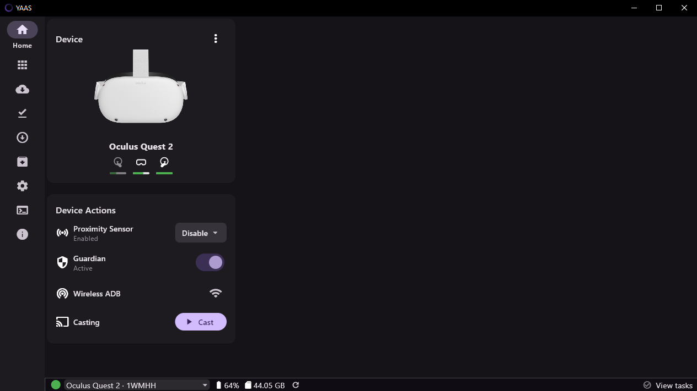
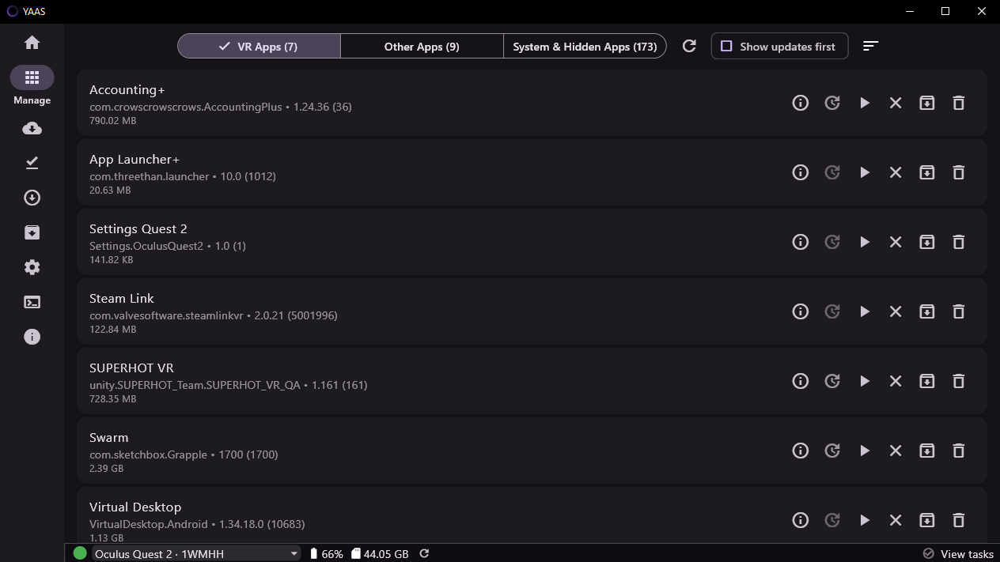
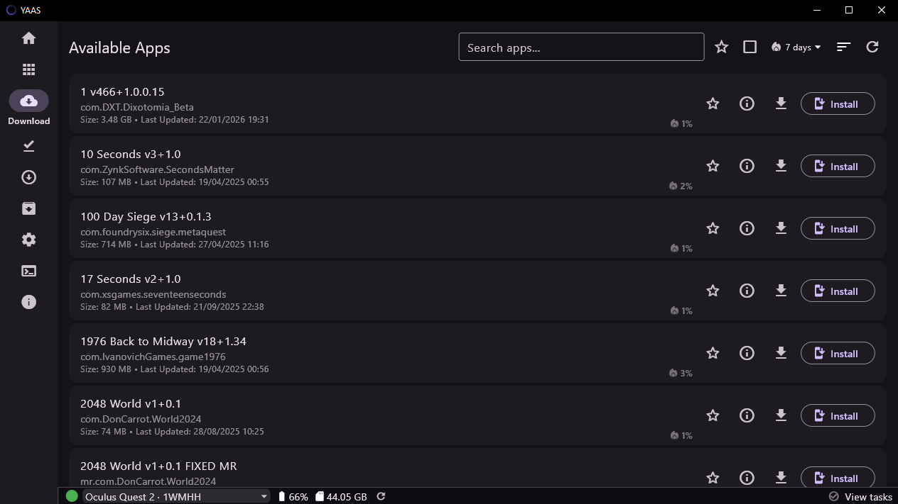
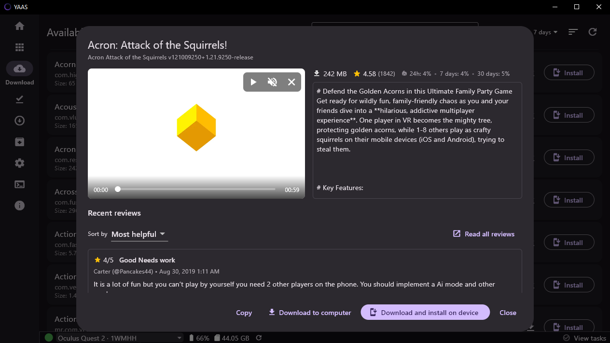
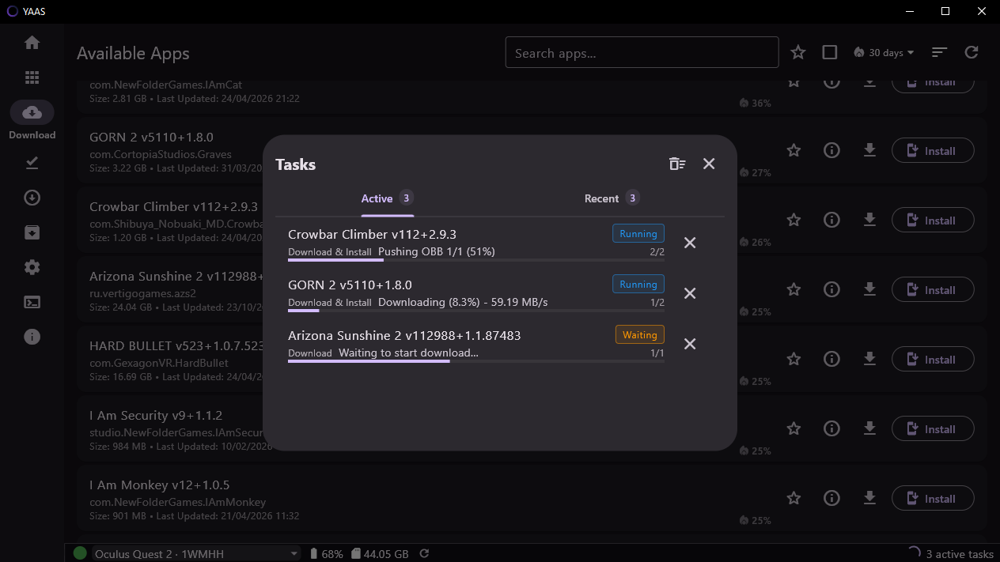
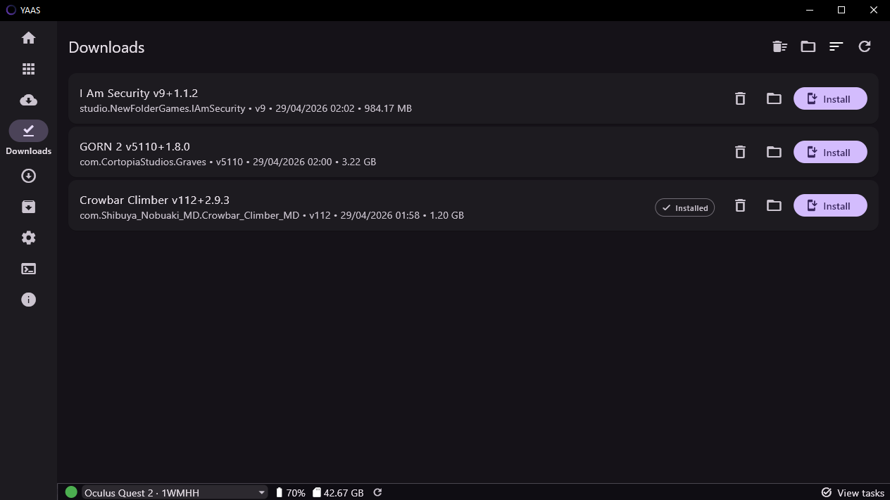

# YAAS

YAAS is a cross-platform desktop application for sideloading applications and managing Meta Quest headsets. It combines a Material Design 3 UI based on Flutter and a Rust core.

## Screenshots









## Architecture

The app is split into two layers:

- Flutter handles the desktop UI, navigation, state presentation, and user interaction
- Rust handles device operations, downloader management, task execution, and other core services


## Data Storage

YAAS uses the following data directories by default:

- macOS: `~/Library/Application Support/YAAS`
- Linux: `$XDG_DATA_HOME/YAAS` or `$HOME/.local/share/YAAS`
- Windows: `%APPDATA%\YAAS`


## Portable Mode

On Linux and Windows, you can enable portable mode:

```bash
./yaas --portable
```

In portable mode, application data is stored alongside the app in `_portable_data`.


## License

This project is licensed under the MIT License. See `LICENSE` for details.
